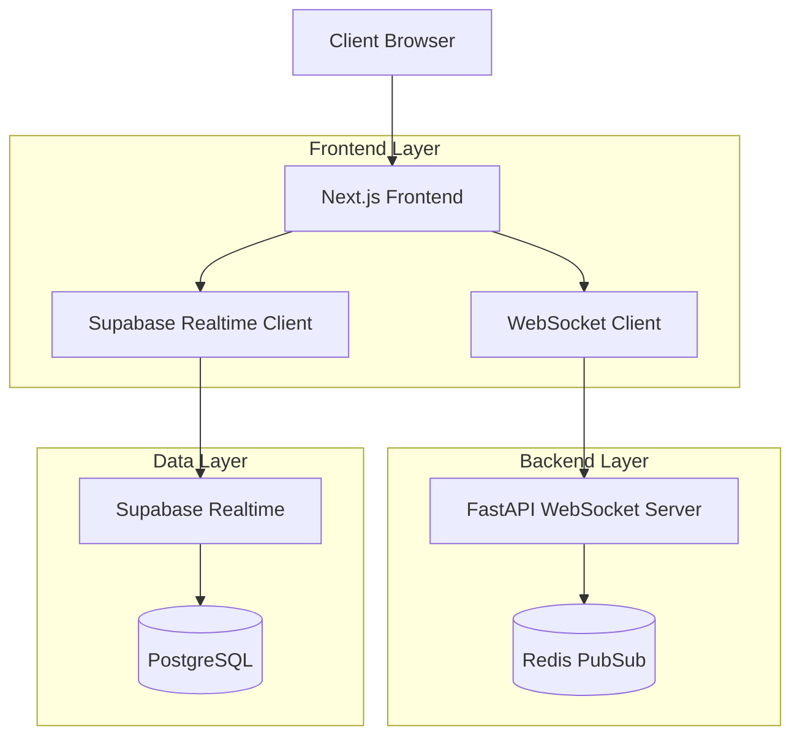
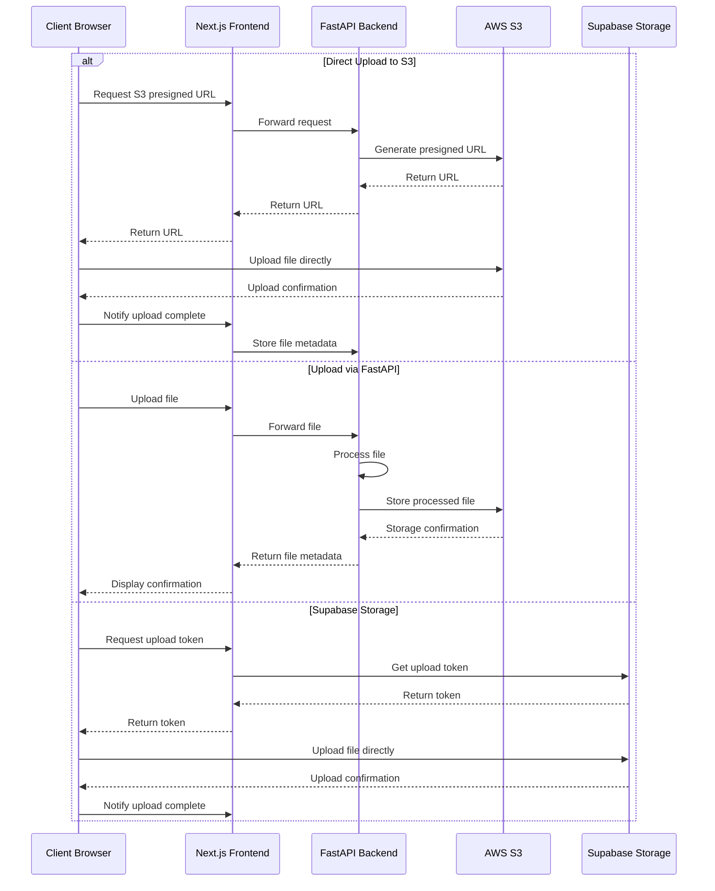
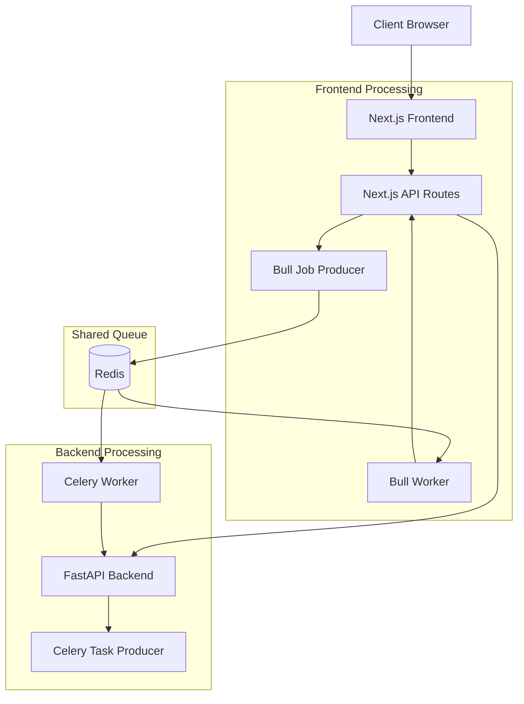
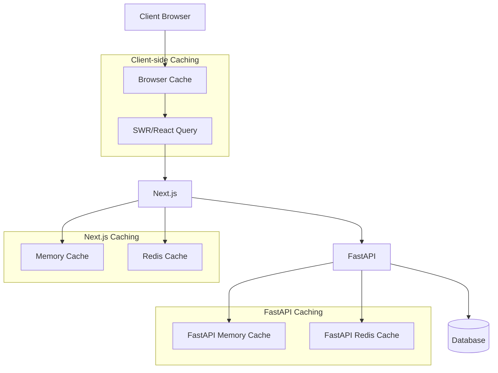
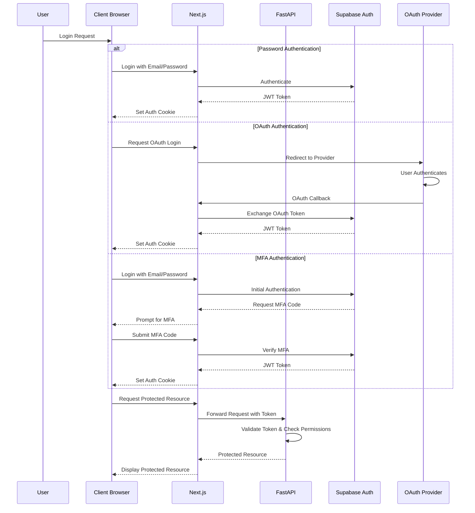

## 4. Advanced Caching Strategies

Caching is a powerful technique to improve the performance and scalability of your application. In this section, we'll explore advanced caching strategies that can be applied in our Think-Tank project.

### 4.1 Implementing Client-side Caching in Next.js

Client-side caching allows you to store data in the browser's cache, reducing the number of requests to the server and improving the user experience.

#### Using the Cache API

Next.js provides a built-in Cache API that allows you to cache responses from API routes. Here's an example of how you can use the Cache API to cache the response from an API route:

```typescript
// pages/api/tasks.ts
import { NextApiRequest, NextApiResponse } from 'next';
import { supabase } from '../../utils/supabase';

export default async function handler(req: NextApiRequest, res: NextApiResponse) {
  const { data, error } = await supabase
    .from('tasks')
    .select('*')
    .order('created_at', { ascending: false });

  if (error) {
    return res.status(500).json({ error: error.message });
  }

  res.setHeader('Cache-Control', 'public, max-age=60, stale-while-revalidate=30');
  return res.status(200).json(data);
}
```

In this example, we set the `Cache-Control` header to cache the response for 60 seconds and allow stale responses to be served for an additional 30 seconds while revalidating in the background.

#### Using SWR

SWR (Stale-While-Revalidate) is a popular library for data fetching and caching in React applications. It provides a simple and efficient way to cache data on the client-side.

Here's an example of how you can use SWR to cache and fetch data in a Next.js component:

```typescript
// components/TaskList.tsx
import useSWR from 'swr';
import { supabase } from '../utils/supabase';

const fetcher = async (url: string) => {
  const { data, error } = await supabase.from('tasks').select('*').order('created_at', { ascending: false });
  if (error) {
    throw error;
  }
  return data;
};

const TaskList: React.FC = () => {
  const { data, error } = useSWR('/api/tasks', fetcher);

  if (error) {
    return <div>Error loading tasks</div>;
  }

  if (!data) {
    return <div>Loading...</div>;
  }

  return (
    <ul>
      {data.map((task) => (
        <li key={task.id}>{task.title}</li>
      ))}
    </ul>
  );
};

export default TaskList;
```

In this example, we define a `fetcher` function that fetches the tasks from Supabase. We then use the `useSWR` hook to cache and fetch the data. SWR automatically handles caching, revalidation, and error handling.

### 4.2 Server-side Caching in FastAPI

Server-side caching allows you to cache responses on the server, reducing the load on your database and improving response times.

#### Using FastAPI's Built-in Caching

FastAPI provides built-in support for caching using the `CacheControl` middleware. Here's an example of how you can use it:

```python
# main.py
from fastapi import FastAPI
from fastapi.middleware.cachecontrol import CacheControlMiddleware

app = FastAPI()

app.add_middleware(CacheControlMiddleware, max_age=60, stale_while_revalidate=30)

@app.get("/tasks")
async def get_tasks():
    # Fetch tasks from the database
    # ...
    return tasks
```

In this example, we add the `CacheControlMiddleware` to the FastAPI app and specify the caching duration and stale-while-revalidate settings.

#### Using Redis for Server-side Caching

For more advanced server-side caching, you can use a distributed caching solution like Redis. Here's an example of how you can integrate Redis with FastAPI:

```python
# main.py
from fastapi import FastAPI
from redis import Redis

app = FastAPI()
redis = Redis(host='localhost', port=6379)

@app.get("/tasks")
async def get_tasks():
    cached_tasks = redis.get("tasks")
    if cached_tasks:
        return cached_tasks

    # Fetch tasks from the database
    # ...

    redis.set("tasks", tasks, ex=60)  # Cache for 60 seconds
    return tasks
```

In this example, we check if the tasks are already cached in Redis. If they are, we return the cached data. Otherwise, we fetch the tasks from the database, cache them in Redis, and return the data.

### 4.3 Cache Invalidation Strategies

Cache invalidation is an important aspect of caching. You need to ensure that the cached data is updated when the underlying data changes.

#### Time-based Invalidation

One simple cache invalidation strategy is to set a time-to-live (TTL) for the cached data. After the TTL expires, the cache is considered stale, and the data is fetched from the source.

#### Event-based Invalidation

Another approach is to invalidate the cache based on specific events. For example, when a task is created, updated, or deleted, you can invalidate the cache for the corresponding data.

Here's an example of how you can implement event-based cache invalidation using Supabase Realtime:

```typescript
// utils/supabase.ts
import { createClient } from '@supabase/supabase-js';

const supabaseUrl = process.env.NEXT_PUBLIC_SUPABASE_URL;
const supabaseAnonKey = process.env.NEXT_PUBLIC_SUPABASE_ANON_KEY;

export const supabase = createClient(supabaseUrl, supabaseAnonKey);

supabase
  .channel('tasks')
  .on('postgres_changes', { event: '*', schema: 'public', table: 'tasks' }, (payload) => {
    // Invalidate cache for tasks
    // ...
  })
  .subscribe();
```

In this example, we subscribe to changes on the `tasks` table using Supabase Realtime. When a change occurs, we can invalidate the cache for the corresponding data.

### 4.4 Using Redis or Similar Tools for Distributed Caching

For distributed caching across multiple instances or services, you can use tools like Redis or Memcached. These tools provide a centralized cache that can be accessed by different parts of your application.

Here's an example of how you can use Redis for distributed caching in a FastAPI application:

```python
# main.py
from fastapi import FastAPI
from redis import Redis

app = FastAPI()
redis = Redis(host='localhost', port=6379)

@app.get("/tasks")
async def get_tasks():
    cached_tasks = redis.get("tasks")
    if cached_tasks:
        return cached_tasks

    # Fetch tasks from the database
    # ...

    redis.set("tasks", tasks, ex=60)  # Cache for 60 seconds
    return tasks
```

In this example, we use Redis as a distributed cache. The cached data can be accessed by different instances of the FastAPI application.

By implementing advanced caching strategies, you can significantly improve the performance and scalability of your Think-Tank project. Client-side caching, server-side caching, cache invalidation, and distributed caching are powerful techniques to optimize data access and reduce the load on your backend systems.
## 5. Advanced Authentication Scenarios

Authentication is a critical aspect of any application. In this section, we'll explore advanced authentication scenarios that can be implemented in our Think-Tank project.
### 5.1 Role-based Access Control Implementation

Role-based access control (RBAC) allows you to control access to resources based on the user's role. Let's see how we can implement RBAC in our Think-Tank project.
#### Defining Role Schemas

First, we need to define the roles and permissions for our application. For example, we might have roles like `admin`, `editor`, and `viewer`.

We can store the roles and permissions in the database or in a configuration file. For simplicity, let's store them in a configuration file:

```python
# config.py
ROLES = {
    "admin": ["*"],  # Full access
    "editor": ["tasks:create", "tasks:read", "tasks:update"],
    "viewer": ["tasks:read"],
}
```
#### Implementing Role Checks in FastAPI

In the FastAPI backend, we can implement role checks using dependencies. Here's an example:

```python
# main.py
from fastapi import FastAPI, Depends, HTTPException
from fastapi.security import OAuth2PasswordBearer
from config import ROLES

app = FastAPI()

oauth2_scheme = OAuth2PasswordBearer(tokenUrl="token")

async def get_current_user(token: str = Depends(oauth2_scheme)):
    # Implement your token verification logic here
#### Role-based UI Rendering in Next.js

In the Next.js frontend, we can use the user's role to conditionally render UI elements. Here's an example:

```typescript
// components/TaskDashboard.tsx
import React from 'react';
import { useSession } from 'next-auth/react';

const TaskDashboard: React.FC = () => {
  const { data: session } = useSession();
  const userRole = session?.user?.role || 'viewer';

#### Testing RBAC Implementations

To ensure that your RBAC implementation is working correctly, it's important to write tests that verify that users with different roles have the appropriate access to resources.

By implementing RBAC, you can control access to resources based on the user's role, enhancing the security and manageability of your Think-Tank project.
### 5.2 Multi-factor Authentication

Multi-factor authentication (MFA) adds an extra layer of security to your application by requiring users to provide multiple factors of authentication. Let's explore how we can implement MFA in our Think-Tank project.

#### Implementing TOTP (Time-based One-Time Password)

TOTP is a common MFA method that uses a time-based one-time password. Here's how you can implement TOTP in your Think-Tank project:

1. **Install a TOTP library**:

   ```bash
   pip install pyotp
   ```

2. **Generate a secret key for each user**:

   ```python
   # main.py
   import pyotp
   import secrets

   def generate_totp_secret():
       return secrets.token_urlsafe(32)

   # Store the secret key securely for each user (e.g., in the database)
   ```

3. **Generate a QR code for the user to scan**:

   ```python
   # main.py
   def generate_totp_qr_code(user_id: str, secret: str):
       totp = pyotp.TOTP(secret)
       uri = totp.provisioning_uri(name=user_id, issuer_name="ThinkTank")
       # Use a QR code library to generate a QR code from the URI
       # ...
       return qr_code_image
### 5.3 OAuth Integration with Third-Party Providers

OAuth allows users to authenticate with your application using their existing accounts from third-party providers like Google, Facebook, or Twitter. Let's explore how we can integrate OAuth into our Think-Tank project.

#### Setting up OAuth with Supabase Auth

Supabase Auth provides built-in support for OAuth integration with various providers. Here's how you can set up OAuth with Supabase Auth:

1. **Enable OAuth providers in the Supabase dashboard**:

   Go to your Supabase project dashboard and navigate to the "Authentication" section. Enable the OAuth providers you want to support (e.g., Google, Facebook, Twitter).

2. **Configure OAuth credentials**:

   For each enabled provider, you'll need to configure the OAuth credentials (e.g., client ID, client secret) provided by the provider.

3. **Implement the OAuth flow in your Next.js frontend**:

   ```typescript
   // components/OAuthSignInButton.tsx
   import { supabase } from '../utils/supabase';

   const OAuthSignInButton: React.FC<{ provider: string }> = ({ provider }) => {
     const handleSignIn = async () => {
### 5.4 Session Management and Security Considerations

Proper session management and security considerations are crucial for protecting user accounts and data. Let's explore some best practices for session management and security in our Think-Tank project.

#### Secure Cookie Handling

Cookies are commonly used to store session information on the client-side. It's important to handle cookies securely to prevent unauthorized access.

1. **Use the `HttpOnly` flag**:

   The `HttpOnly` flag prevents client-side scripts from accessing the cookie, reducing the risk of cross-site scripting (XSS) attacks.

2. **Use the `Secure` flag**:

   The `Secure` flag ensures that the cookie is only transmitted over HTTPS, protecting it from eavesdropping.

3. **Set the `SameSite` attribute**:

   The `SameSite` attribute controls whether the cookie is sent with cross-site requests, mitigating the risk of cross-site request forgery (CSRF) attacks.
## Conclusion

This tutorial covered advanced integration topics for the Think-Tank project, including real-time updates, file uploads and media handling, background processing, advanced caching strategies, and advanced authentication scenarios.

By implementing these techniques, you can significantly enhance the functionality, performance, and security of your Think-Tank project.
## Basic Deployment Build Commands

To prepare your Think-Tank project for deployment, you'll need to build both the Next.js frontend and the FastAPI backend.

The **build command** for the Next.js frontend is:
```bash
npm run build
or

This command will create an optimized production build of your Next.js application in the `.next` directory.
```bash
yarn build
```
For Render deployments, the **build command** is:
```bash
pip install -r requirements.txt
Make sure that the `requirements.txt` file is located in the root directory of your repository.
```
For Render deployments, the **build command** is:
```
the **build command** is:
```bash
pip install -r requirements.txt
Make sure that the `requirements.txt` file is located in the root directory of your repository.
```
```bash
docker build -t your-image-name .
This command will build a Docker image from your project's Dockerfile.
```
### Next.js Frontend

The build command for the Next.js frontend is typically:

```bash
npm run build
```

or

```bash
## Deployment Configurations

This section provides guidance on configuring your Think-Tank project for deployment to various environments.

### Vercel Frontend Deployment

To ensure a successful Vercel build, it's important to use the correct branch and address any potential build errors.

#### Branch Selection

When deploying to Vercel, make sure you're deploying the branch that includes the necessary fixes for Vercel build errors. In this project, the `fix/vercel-build-errors` branch contains fixes for issues such as the `react-beautiful-dnd` type error and the `next.config.js` warning.

You can merge the `fix/vercel-build-errors` branch into your main branch (or into a dedicated deployment branch) and then deploy that updated branch to Vercel.

#### Addressing Deprecated Packages

The Vercel build log may show warnings about deprecated packages. While these warnings don't usually stop the build, it's good practice to update these dependencies to keep your project modern and secure.

Some notable deprecated packages include:

- `@supabase/auth-helpers-nextjs`: Consider migrating to `@supabase/ssr`.
- `react-beautiful-dnd`: Check for newer versions or alternative libraries.

To update these dependencies, you can use the following commands:

```bash
npm update @supabase/auth-helpers-nextjs
npm update react-beautiful-dnd
```

or

```bash
yarn upgrade @supabase/auth-helpers-nextjs
yarn upgrade react-beautiful-dnd
```

After updating the dependencies, make sure to test your application thoroughly to ensure that everything is working as expected.

By following these guidelines, you can ensure a successful Vercel build for your Think-Tank project.
yarn build
```

This command will create an optimized production build of your Next.js application in the `.next` directory.

### FastAPI Backend

The build process for the FastAPI backend depends on your deployment environment.

#### Docker Deployment

If you're deploying your FastAPI backend using Docker, the build command would be:

```bash
docker build -t your-image-name .
```

This command will build a Docker image from your project's Dockerfile.

#### Serverless Deployment

If you're deploying your FastAPI backend to a serverless environment, the build process might involve packaging the code and dependencies into a zip file. Refer to your serverless provider's documentation for specific instructions.

Remember to adapt the code examples and best practices to your specific needs and always prioritize security and user experience.

## Diagrams

I'll include the following Mermaid diagrams to illustrate key concepts:

1. **Real-time Updates Architecture**


2. **File Upload and Storage Flow**


3. **Background Processing Architecture**


4. **Multi-level Caching Strategy**


5. **Advanced Authentication Flow**


#### Token Rotation

Token rotation involves periodically refreshing the user's authentication token to reduce the risk of token theft or compromise.

#### Session Timeout and Renewal

To prevent unauthorized access to inactive accounts, it's important to implement session timeouts. After a period of inactivity, the user's session should be automatically terminated.

You can also implement session renewal to extend the session timeout when the user is active.

#### CSRF Protection

Cross-site request forgery (CSRF) is a type of attack that allows an attacker to perform actions on behalf of a user without their knowledge.

To protect against CSRF attacks, you can use techniques like:

1. **Synchronizer token pattern**: Generate a unique token for each session and include it in all forms and API requests.
2. **Double Submit Cookie**: Set a random value in a cookie and include the same value in a form field.

By implementing these session management and security considerations, you can significantly enhance the security of your Think-Tank project and protect user accounts from unauthorized access.
       const { error } = await supabase.auth.signInWithOAuth({ provider });

       if (error) {
         console.error('Error signing in with OAuth:', error);
       }
     };

     return (
       <button onClick={handleSignIn}>Sign in with {provider}</button>
     );
   };

   export default OAuthSignInButton;
   ```

   This component uses the `signInWithOAuth` method from the Supabase client to initiate the OAuth flow.

4. **Handle the OAuth callback in your Next.js API routes**:

   Supabase Auth automatically handles the OAuth callback and redirects the user back to your application with a JWT token.

#### Custom OAuth Flows in FastAPI

For more advanced OAuth scenarios, you can implement custom OAuth flows in your FastAPI backend. This allows you to have more control over the authentication process and integrate with providers that are not directly supported by Supabase Auth.

#### Handling OAuth Callbacks

When the user authenticates with the third-party provider, they will be redirected back to your application with an authorization code. You need to handle this callback and exchange the authorization code for an access token.

#### Token Refresh Strategies

Access tokens typically have a limited lifespan. You need to implement a token refresh strategy to automatically refresh the access token before it expires.

By integrating OAuth with third-party providers, you can simplify the authentication process for your users and provide a seamless login experience in your Think-Tank project.
   ```

4. **Verify the TOTP code submitted by the user**:

   ```python
   # main.py
   def verify_totp_code(secret: str, code: str):
       totp = pyotp.TOTP(secret)
       return totp.verify(code)
   ```

#### SMS Verification

SMS verification involves sending a verification code to the user's phone number. Here's how you can implement SMS verification in your Think-Tank project:

1. **Choose an SMS provider**:

   There are many SMS providers available, such as Twilio, Vonage, and AWS SNS.

2. **Send an SMS verification code to the user's phone number**:

   ```python
   # main.py
   import twilio
   def send_sms_verification_code(phone_number: str, code: str):
       # Use the SMS provider's API to send the SMS
       # ...
       pass
   ```

3. **Verify the SMS verification code submitted by the user**:

   ```python
   # main.py
   def verify_sms_code(phone_number: str, code: str):
       # Verify the SMS code against the stored code for the user
       # ...
       return True or False
   ```

#### Email Verification

Email verification involves sending a verification link to the user's email address. Here's how you can implement email verification in your Think-Tank project:

1. **Send an email verification link to the user's email address**:

   ```python
   # main.py
   def send_email_verification_link(email: str, token: str):
       # Generate a verification link with the token
       # Send the email using an email service
       # ...
       pass
   ```

2. **Verify the email verification link when the user clicks on it**:

   ```python
   # main.py
   def verify_email_token(token: str):
       # Verify the token against the stored token for the user
       # ...
       return True or False
   ```

#### Recovery Options

It's important to provide recovery options for users who lose access to their MFA devices. Some common recovery options include:

1. **Backup codes**: Generate a set of backup codes that the user can use to log in if they lose access to their MFA device.
2. **Recovery email**: Send a recovery link to the user's recovery email address.
3. **Account recovery process**: Implement an account recovery process that requires the user to answer security questions or provide other identifying information.

By implementing MFA and providing recovery options, you can significantly enhance the security of your Think-Tank project and protect user accounts from unauthorized access.
  return (
    <div>
      <h1>Task Dashboard</h1>
      {userRole === 'admin' && (
        <button>Create New Task</button>
      )}
      {userRole === 'editor' && (
        <button>Edit Task</button>
      )}
      {/* Display task list for all roles */}
      {/* ... */}
    </div>
  );
};

export default TaskDashboard;
```

In this example, we use the `useSession` hook from `next-auth` to get the current user's role. We then use this role to conditionally render the "Create New Task" and "Edit Task" buttons.
    # For example, you might decode a JWT token
    user = verify_token(token)
    if not user:
        raise HTTPException(status_code=401, detail="Invalid token")
    return user

async def has_permission(permission: str, user: dict = Depends(get_current_user)):
    if user["role"] not in ROLES:
        raise HTTPException(status_code=403, detail="Unauthorized: Invalid role")
    
    if "*" in ROLES[user["role"]] or permission in ROLES[user["role"]]:
        return True
    else:
        raise HTTPException(status_code=403, detail="Unauthorized: Insufficient permissions")

@app.post("/tasks", dependencies=[Depends(lambda: has_permission("tasks:create"))])
async def create_task():
    # Only users with the "tasks:create" permission can access this endpoint
    # ...
    return {"message": "Task created successfully"}
```

In this example, we define a `has_permission` dependency that checks if the current user has the required permission. We then use this dependency to protect the `/tasks` endpoint, ensuring that only users with the `tasks:create` permission can access it.

This configuration defines three roles: `admin`, `editor`, and `viewer`. The `admin` role has full access to all resources, while the `editor` and `viewer` roles have limited access to tasks.