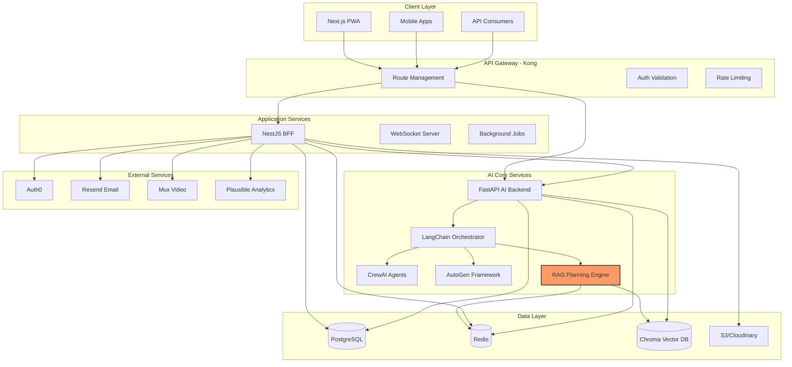

# Integrating RAG-Formatted Agentic Planning Engine with THINKTANK Architecture

## Executive Overview

This comprehensive implementation guide details how to integrate a state-of-the-art RAG-Formatted Agentic Planning Engine into the THINKTANK hybrid architecture. The integration leverages the strengths of both systems: the sophisticated planning capabilities of the agentic engine and the robust, scalable infrastructure of the THINKTANK deployment architecture. This guide provides a detailed roadmap for technical teams to implement this integration, resulting in an advanced AI system capable of complex planning, expert debate orchestration, and business-ready SaaS delivery.

## Architectural Integration Framework

The integration follows a layered approach that preserves the core strengths of both systems while creating seamless interactions between components. The RAG-Formatted Agentic Planning Engine will be implemented as a specialized service within the AI Core Services layer of the THINKTANK architecture, with appropriate interfaces to the NestJS Backend-for-Frontend (BFF) layer and data persistence systems.

### Integrated Architecture Diagram



## Implementation Phases

### Phase 1: RAG Planning Engine Core Implementation

The first phase involves implementing the core RAG Planning Engine as a Python module within the AI backend services. This implementation follows the structured planning framework outlined in the RAG-Formatted Agentic Planning Engine prompt.

```python
# apps/ai-backend/app/services/rag_planning_engine.py
from typing import Dict, List, Any, Optional
from pydantic import BaseModel
import asyncio
from langchain.chat_models import ChatOpenAI
from langchain.embeddings import OpenAIEmbeddings
from langchain.vectorstores import Chroma
from langchain.prompts import ChatPromptTemplate
from langchain.schema import Document
import json
import os

class PlanningState(BaseModel):
    """Represents a state in the planning system"""
    state_id: str
    description: str
    variables: Dict[str, Any]
    
class PlanningAction(BaseModel):
    """Represents an action that can transform states"""
    action_id: str
    name: str
    description: str
    preconditions: List[str]
    effects: List[str]
    
class PlanningEvent(BaseModel):
    """Represents external events that can affect states"""
    event_id: str
    name: str
    description: str
    trigger_conditions: List[str]
    effects: List[str]

class PlanningIntent(BaseModel):
    """Captures the user's planning intent"""
    query: str
    initial_state: Dict[str, Any]
    goal_state: Dict[str, Any]
    constraints: List[str]
    domain: str

class PlanStep(BaseModel):
    """Represents a single step in a generated plan"""
    step_id: int
    action: str
    preconditions: List[str]
    effects: List[str]
    justification: str
    
class Plan(BaseModel):
    """Represents a complete plan"""
    plan_id: str
    intent: PlanningIntent
    steps: List[PlanStep]
    alternatives: Optional[List[List[PlanStep]]] = None
    risk_assessment: Optional[Dict[str, Any]] = None

class RAGPlanningEngine:
    """
    Implementation of the RAG-Formatted Agentic Planning Engine
    """
    def __init__(self, llm_manager, vector_search):
        self.llm_manager = llm_manager
        self.vector_search = vector_search
        self.embeddings = OpenAIEmbeddings()
        
        # System prompts for different planning stages
        self.parse_prompt = ChatPromptTemplate.from_template(
            """
            SYSTEM CONTEXT:
            You are an advanced Agentic Planning Engine with RAG capabilities.
            
            PLANNING FRAMEWORK:
            Apply state-transition system modeling where:
            - States (S) = All possible world configurations
            - Actions (A) = Deliberate operations that change states
            - Events (E) = External occurrences affecting states
            - Transition Function (γ) = How actions/events transform states
            
            TASK:
            Parse the following query to extract planning intent, initial state, and desired goals.
            
            USER QUERY:
            {query}
            
            OUTPUT FORMAT:
            Return a JSON object with the following structure:
            {{
                "intent": "extracted planning intent",
                "initial_state": {{ key-value pairs representing initial state }},
                "goal_state": {{ key-value pairs representing goal state }},
                "constraints": ["constraint1", "constraint2", ...],
                "domain": "identified domain of planning"
            }}
            """
        )
        
        self.retrieve_prompt = ChatPromptTemplate.from_template(
            """
            SYSTEM CONTEXT:
            You are the Knowledge Retrieval component of an advanced Agentic Planning Engine.
            
            TASK:
            Based on the planning intent and domain, identify the most relevant knowledge, techniques, and precedents.
            
            PLANNING INTENT:
            {intent}
            
            DOMAIN:
            {domain}
            
            INITIAL STATE:
            {initial_state}
            
            GOAL STATE:
            {goal_state}
            
            CONSTRAINTS:
            {constraints}
            
            OUTPUT FORMAT:
            Return a JSON object with the following structure:
            {{
                "relevant_knowledge": ["knowledge1", "knowledge2", ...],
                "applicable_techniques": ["technique1", "technique2", ...],
                "similar_precedents": ["precedent1", "precedent2", ...],
                "search_queries": ["query1", "query2", ...]
            }}
            """
        )
        
        self.strategize_prompt = ChatPromptTemplate.from_template(
            """
            SYSTEM CONTEXT:
            You are the Strategy Selection component of an advanced Agentic Planning Engine.
            
            TASK:
            Select the most appropriate planning approach based on the intent, domain, and retrieved knowledge.
            
            PLANNING INTENT:
            {intent}
            
            DOMAIN:
            {domain}
            
            RETRIEVED KNOWLEDGE:
            {knowledge}
            
            APPLICABLE TECHNIQUES:
            {techniques}
            
            SIMILAR PRECEDENTS:
            {precedents}
            
            OUTPUT FORMAT:
            Return a JSON object with the following structure:
            {{
                "chosen_approach": "selected planning approach",
                "justification": "reasoning for selection",
                "alternative_approaches": ["alternative1", "alternative2", ...],
                "expected_challenges": ["challenge1", "challenge2", ...]
            }}
            """
        )
        
        self.generate_prompt = ChatPromptTemplate.from_template(
            """
            SYSTEM CONTEXT:
            You are the Plan Generation component of an advanced Agentic Planning Engine.
            
            PLANNING FRAMEWORK:
            Apply state-transition system modeling where:
            - States (S) = All possible world configurations
            - Actions (A) = Deliberate operations that change states
            - Events (E) = External occurrences affecting states
            - Transition Function (γ) = How actions/events transform states
            
            TASK:
            Generate a detailed plan using the selected approach to transform the initial state to the goal state.
            
            PLANNING INTENT:
            {intent}
            
            INITIAL STATE:
            {initial_state}
            
            GOAL STATE:
            {goal_state}
            
            CONSTRAINTS:
            {constraints}
            
            CHOSEN APPROACH:
            {approach}
            
            RETRIEVED KNOWLEDGE:
            {knowledge}
            
            OUTPUT FORMAT:
            Return a JSON object with the following structure:
            {{
                "plan_steps": [
                    {{
                        "step_id": 1,
                        "action": "action description",
                        "preconditions": ["precondition1", "precondition2", ...],
                        "effects": ["effect1", "effect2", ...],
                        "justification": "reasoning for this step"
                    }},
                    ...
                ],
                "alternative_paths": [
                    [
                        {{
                            "step_id": 1,
                            "action": "alternative action",
                            "preconditions": ["precondition1", "precondition2", ...],
                            "effects": ["effect1", "effect2", ...],
                            "justification": "reasoning for this alternative"
                        }},
                        ...
                    ]
                ],
                "risk_assessment": {{
                    "identified_risks": ["risk1", "risk2", ...],
                    "mitigation_strategies": ["strategy1", "strategy2", ...]
                }}
            }}
            """
        )
        
        self.validate_prompt = ChatPromptTemplate.from_template(
            """
            SYSTEM CONTEXT:
            You are the Plan Validation component of an advanced Agentic Planning Engine.
            
            TASK:
            Validate the generated plan for completeness, feasibility, and optimality.
            
            PLANNING INTENT:
            {intent}
            
            INITIAL STATE:
            {initial_state}
            
            GOAL STATE:
            {goal_state}
            
            CONSTRAINTS:
            {constraints}
            
            GENERATED PLAN:
            {plan}
            
            OUTPUT FORMAT:
            Return a JSON object with the following structure:
            {{
                "is_valid": true/false,
                "completeness_score": 0-100,
                "feasibility_score": 0-100,
                "optimality_score": 0-100,
                "identified_issues": ["issue1", "issue2", ...],
                "suggested_improvements": ["improvement1", "improvement2", ...],
                "final_assessment": "overall assessment of plan quality"
            }}
            """
        )
    
    async def parse_intent(self, query: str) -> PlanningIntent:
        """Extract planning intent from user query"""
        llm = self.llm_manager.get_llm("gpt-4")
        
        response = await llm.agenerate([self.parse_prompt.format(query=query)])
        content = response.generations[0][0].text
        
        try:
            intent_data = json.loads(content)
            return PlanningIntent(
                query=query,
                initial_state=intent_data["initial_state"],
                goal_state=intent_data["goal_state"],
                constraints=intent_data["constraints"],
                domain=intent_data["domain"]
            )
        except Exception as e:
            raise ValueError(f"Failed to parse planning intent: {str(e)}")
    
    async def retrieve_knowledge(self, intent: PlanningIntent) -> Dict[str, Any]:
        """Retrieve relevant knowledge for planning"""
        llm = self.llm_manager.get_llm("gpt-4")
        
        # Format the intent for the prompt
        response = await llm.agenerate([
            self.retrieve_prompt.format(
                intent=intent.query,
                domain=intent.domain,
                initial_state=json.dumps(intent.initial_state),
                goal_state=json.dumps(intent.goal_state),
                constraints=", ".join(intent.constraints)
            )
        ])
        content = response.generations[0][0].text
        
        try:
            knowledge_data = json.loads(content)
            
            # Use the suggested search queries to retrieve documents from vector store
            retrieved_docs = []
            for query in knowledge_data["search_queries"]:
                docs = await self.vector_search.search(
                    query=query,
                    collection="planning_knowledge",
                    limit=5
                )
                retrieved_docs.extend(docs)
            
            # Deduplicate and add to knowledge
            unique_docs = {doc.metadata["id"]: doc for doc in retrieved_docs}
            knowledge_data["retrieved_documents"] = list(unique_docs.values())
            
            return knowledge_data
        except Exception as e:
            raise ValueError(f"Failed to retrieve knowledge: {str(e)}")
    
    async def select_strategy(
        self, 
        intent: PlanningIntent, 
        knowledge: Dict[str, Any]
    ) -> Dict[str, Any]:
        """Select appropriate planning strategy"""
        llm = self.llm_manager.get_llm("gpt-4")
        
        response = await llm.agenerate([
            self.strategize_prompt.format(
                intent=intent.query,
                domain=intent.domain,
                knowledge=", ".join(knowledge["relevant_knowledge"]),
                techniques=", ".join(knowledge["applicable_techniques"]),
                precedents=", ".join(knowledge["similar_precedents"])
            )
        ])
        content = response.generations[0][0].text
        
        try:
            strategy_data = json.loads(content)
            return strategy_data
        except Exception as e:
            raise ValueError(f"Failed to select strategy: {str(e)}")
    
    async def generate_plan(
        self,
        intent: PlanningIntent,
        knowledge: Dict[str, Any],
        strategy: Dict[str, Any]
    ) -> Dict[str, Any]:
        """Generate plan using selected strategy"""
        llm = self.llm_manager.get_llm("gpt-4")
        
        response = await llm.agenerate([
            self.generate_prompt.format(
                intent=intent.query,
                initial_state=json.dumps(intent.initial_state),
                goal_state=json.dumps(intent.goal_state),
                constraints=", ".join(intent.constraints),
                approach=strategy["chosen_approach"],
                knowledge=", ".join(knowledge["relevant_knowledge"])
            )
        ])
        content = response.generations[0][0].text
        
        try:
            plan_data = json.loads(content)
            return plan_data
        except Exception as e:
            raise ValueError(f"Failed to generate plan: {str(e)}")
    
    async def validate_plan(
        self,
        intent: PlanningIntent,
        plan: Dict[str, Any]
    ) -> Dict[str, Any]:
        """Validate generated plan"""
        llm = self.llm_manager.get_llm("gpt-4")
        
        response = await llm.agenerate([
            self.validate_prompt.format(
                intent=intent.query,
                initial_state=json.dumps(intent.initial_state),
                goal_state=json.dumps(intent.goal_state),
                constraints=", ".join(intent.constraints),
                plan=json.dumps(plan)
            )
        ])
        content = response.generations[0][0].text
        
        try:
            validation_data = json.loads(content)
            return validation_data
        except Exception as e:
            raise ValueError(f"Failed to validate plan: {str(e)}")
    
    async def create_plan(self, query: str, user_id: str, context: Dict[str, Any] = None) -> Plan:
        """
        Main entry point for plan creation
        Implements the full RAG planning workflow
        """
        # Step 1: Parse intent
        intent = await self.parse_intent(query)
        
        # Step 2: Retrieve knowledge
        knowledge = await self.retrieve_knowledge(intent)
        
        # Step 3: Select strategy
        strategy = await self.select_strategy(intent, knowledge)
        
        # Step 4: Generate plan
        plan_data = await self.generate_plan(intent, knowledge, strategy)
        
        # Step 5: Validate plan
        validation = await self.validate_plan(intent, plan_data)
        
        # Step 6: Create final plan object
        plan_steps = []
        for step in plan_data["plan_steps"]:
            plan_steps.append(PlanStep(
                step_id=step["step_id"],
                action=step["action"],
                preconditions=step["preconditions"],
                effects=step["effects"],
                justification=step["justification"]
            ))
        
        # Create alternative paths if available
        alternatives = None
        if "alternative_paths" in plan_data and plan_data["alternative_paths"]:
            alternatives = []
            for alt_path in plan_data["alternative_paths"]:
                alt_steps = []
                for step in alt_path:
                    alt_steps.append(PlanStep(
                        step_id=step["step_id"],
                        action=step["action"],
                        preconditions=step["preconditions"],
                        effects=step["effects"],
                        justification=step["justification"]
                    ))
                alternatives.append(alt_steps)
        
        # Create final plan
        final_plan = Plan(
            plan_id=f"plan_{user_id}_{int(time.time())}",
            intent=intent,
            steps=plan_steps,
            alternatives=alternatives,
            risk_assessment=plan_data.get("risk_assessment")
        )
        
        return final_plan
```

### Phase 2: Integration with THINKTANK AI Backend

The second phase involves integrating the RAG Planning Engine with the existing THINKTANK AI backend services, particularly the FastAPI backend and the planning workflow.

```python
# apps/ai-backend/app/services/planning_workflow.py
from typing import Dict, List, Any
import asyncio
from .rag_planning_engine import RAGPlanningEngine
from .llm_manager import LLMManager
from .vector_search import VectorSearchService
from app.core.config import settings
from app.db.models import PlanningDocument, User
from app.db.session import get_db
import json
import time

class PlanningWorkflow:
    def __init__(self, llm_manager: LLMManager, vector_search: VectorSearchService):
        self.llm_manager = llm_manager
        self.vector_search = vector_search
        self.rag_planning_engine = RAGPlanningEngine(llm_manager, vector_search)
    
    async def generate_documents(
        self,
        initial_query: str,
        user_id: str,
        context: Dict[str, Any] = None
    ) -> Dict[str, Any]:
        """
        Generate planning and task documents using the RAG Planning Engine
        """
        # Step 1: Create plan using RAG Planning Engine
        plan = await self.rag_planning_engine.create_plan(
            query=initial_query,
            user_id=user_id,
            context=context
        )
        
        # Step 2: Generate document representations
        documents = await self._generate_document_representations(plan)
        
        # Step 3: Store documents in database
        db = next(get_db())
        user = db.query(User).filter(User.id == user_id).first()
        
        stored_docs = []
        for doc_type, content in documents.items():
            doc = PlanningDocument(
                user_id=user_id,
                plan_id=plan.plan_id,
                document_type=doc_type,
                content=content,
                created_at=int(time.time())
            )
            db.add(doc)
            stored_docs.append(doc)
        
        db.commit()
        
        # Step 4: Return results
        return {
            "plan_id": plan.plan_id,
            "documents": {doc.document_type: doc.id for doc in stored_docs},
            "summary": documents["summary"]
        }
    
    async def _generate_document_representations(self, plan) -> Dict[str, str]:
        """
        Generate different document representations of the plan
        """
        llm = self.llm_manager.get_llm("gpt-4")
        
        # Generate summary document
        summary_prompt = ChatPromptTemplate.from_template(
            """
            Create a concise executive summary of the following plan:
            
            PLAN DETAILS:
            {plan}
            
            The summary should be professional, clear, and highlight the key objectives,
            approach, and expected outcomes. Keep it under 500 words.
            """
        )
        
        summary_response = await llm.agenerate([
            summary_prompt.format(plan=json.dumps(plan.dict()))
        ])
        summary = summary_response.generations[0][0].text
        
        # Generate detailed implementation document
        implementation_prompt = ChatPromptTemplate.from_template(
            """
            Create a detailed implementation guide based on the following plan:
            
            PLAN DETAILS:
            {plan}
            
            The implementation guide should:
            1. Break down each step into actionable tasks
            2. Provide technical details and requirements
            3. Include timelines and dependencies
            4. Address potential challenges and mitigation strategies
            
            Format the document in Markdown with clear sections, subsections, and code examples where appropriate.
            """
        )
        
        implementation_response = await llm.agenerate([
            implementation_prompt.format(plan=json.dumps(plan.dict()))
        ])
        implementation = implementation_response.generations[0][0].text
        
        # Generate presentation document
        presentation_prompt = ChatPromptTemplate.from_template(
            """
            Create a presentation outline based on the following plan:
            
            PLAN DETAILS:
            {plan}
            
            The presentation should:
            1. Have a compelling introduction that explains the problem and solution
            2. Include key slides for each major plan component
            3. Highlight benefits, ROI, and success metrics
            4. Address potential questions and concerns
            
            Format the document in Markdown with clear slide titles and bullet points for content.
            """
        )
        
        presentation_response = await llm.agenerate([
            presentation_prompt.format(plan=json.dumps(plan.dict()))
        ])
        presentation = presentation_response.generations[0][0].text
        
        return {
            "summary": summary,
            "implementation": implementation,
            "presentation": presentation,
            "raw_plan": json.dumps(plan.dict(), indent=2)
        }
```

### Phase 3: Updating FastAPI Main Application

Update the main FastAPI application to include the new RAG Planning Engine endpoints.

```python
# apps/ai-backend/main.py
# Add to existing imports
from app.services.rag_planning_engine import RAGPlanningEngine

# Initialize services (add to existing initializations)
rag_planning_engine = RAGPlanningEngine(llm_manager, vector_search)

# Add new endpoint
@app.post("/api/v1/planning/rag-plan", dependencies=[Depends(verify_internal_token)])
async def generate_rag_plan(request: Dict[str, Any]):
    """Generate a plan using the RAG Planning Engine"""
    try:
        plan = await rag_planning_engine.create_plan(
            query=request["query"],
            user_id=request["userId"],
            context=request.get("context", {})
        )
        return {"success": True, "data": plan.dict()}
    except Exception as e:
        raise HTTPException(status_code=500, detail=str(e))
```

### Phase 4: NestJS BFF Integration

Extend the NestJS Backend-for-Frontend layer to include the RAG Planning Engine capabilities.

```typescript
// apps/api-gateway/src/modules/ai-proxy/ai-proxy.service.ts
// Add to existing methods

async generateRAGPlan(userId: string, query: string, context: any) {
  const aiBackendUrl = this.configService.get('AI_BACKEND_URL');
  
  // Notify WebSocket clients
  this.server.clients.forEach(client => {
    client.send(JSON.stringify({
      type: 'planning.rag.started',
      userId,
      query
    }));
  });
  
  // Call Python AI backend
  const response = await firstValueFrom(
    this.httpService.post(`${aiBackendUrl}/api/v1/planning/rag-plan`, {
      query,
      userId,
      context
    }, {
      headers: {
        'X-Internal-Token': this.configService.get('INTERNAL_API_TOKEN')
      }
    })
  );
  
  return response.data;
}
```

```typescript
// apps/api-gateway/src/modules/ai-proxy/ai-proxy.controller.ts
import { Controller, Post, Body, UseGuards, Req } from '@nestjs/common';
import { AuthGuard } from '@nestjs/passport';
import { AIProxyService } from './ai-proxy.service';

@Controller('api/ai')
@UseGuards(AuthGuard('jwt'))
export class AIProxyController {
  constructor(private aiProxyService: AIProxyService) {}
  
  @Post('debate/initiate')
  async initiateDebate(@Body() body: any, @Req() req: any) {
    const userId = req.user.sub;
    return this.aiProxyService.initiateDebate(
      userId,
      body.query,
      body.options || {}
    );
  }
  
  @Post('planning/generate')
  async generatePlanning(@Body() body: any, @Req() req: any) {
    const userId = req.user.sub;
    return this.aiProxyService.generatePlanning(
      userId,
      body.query,
      body.context || {}
    );
  }
  
  @Post('planning/rag-plan')
  async generateRAGPlan(@Body() body: any, @Req() req: any) {
    const userId = req.user.sub;
    return this.aiProxyService.generateRAGPlan(
      userId,
      body.query,
      body.context || {}
    );
  }
}
```

### Phase 5: Frontend Integration

Extend the Next.js frontend to include the RAG Planning Engine UI components.

```typescript
// apps/web/components/planning/rag-planning-form.tsx
import { useState } from 'react';
import { Button } from '@/components/ui/button';
import { Input } from '@/components/ui/input';
import { Textarea } from '@/components/ui/textarea';
import { Card, CardContent, CardDescription, CardFooter, CardHeader, CardTitle } from '@/components/ui/card';
import { useToast } from '@/components/ui/use-toast';
import { Loader2 } from 'lucide-react';

export function RAGPlanningForm({ onPlanCreated }) {
  const [query, setQuery] = useState('');
  const [loading, setLoading] = useState(false);
  const { toast } = useToast();
  
  const handleSubmit = async (e) => {
    e.preventDefault();
    
    if (!query.trim()) {
      toast({
        title: 'Query required',
        description: 'Please enter a planning query to continue.',
        variant: 'destructive',
      });
      return;
    }
    
    setLoading(true);
    
    try {
      const response = await fetch('/api/ai/planning/rag-plan', {
        method: 'POST',
        headers: {
          'Content-Type': 'application/json',
        },
        body: JSON.stringify({
          query,
          context: {},
        }),
      });
      
      if (!response.ok) {
        throw new Error('Failed to generate plan');
      }
      
      const data = await response.json();
      
      toast({
        title: 'Plan generated successfully',
        description: 'Your RAG-enhanced plan has been created.',
      });
      
      if (onPlanCreated) {
        onPlanCreated(data);
      }
    } catch (error) {
      toast({
        title: 'Error',
        description: error.message || 'Failed to generate plan',
        variant: 'destructive',
      });
    } finally {
      setLoading(false);
    }
  };
  
  return (
    <Card className="w-full">
      <CardHeader>
        <CardTitle>RAG Planning Engine</CardTitle>
        <CardDescription>
          Generate comprehensive plans using our advanced RAG-enhanced planning system
        </CardDescription>
      </CardHeader>
      <form onSubmit={handleSubmit}>
        <CardContent>
          <div className="grid gap-4">
            <div className="grid gap-2">
              <label htmlFor="query">Planning Query</label>
              <Textarea
                id="query"
                placeholder="Describe your planning needs in detail..."
                value={query}
                onChange={(e) => setQuery(e.target.value)}
                className="min-h-[120px]"
                required
              />
            </div>
          </div>
        </CardContent>
        <CardFooter>
          <Button type="submit" disabled={loading} className="w-full">
            {loading ? (
              <>
                <Loader2 className="mr-2 h-4 w-4 animate-spin" />
                Generating Plan...
              </>
            ) : (
              'Generate Plan'
            )}
          </Button>
        </CardFooter>
      </form>
    </Card>
  );
}
```

```typescript
// apps/web/components/planning/plan-viewer.tsx
import { useState, useEffect } from 'react';
import { Tabs, TabsContent, TabsList, TabsTrigger } from '@/components/ui/tabs';
import { Card, CardContent, CardDescription, CardHeader, CardTitle } from '@/components/ui/card';
import { Button } from '@/components/ui/button';
import { Download, Share2 } from 'lucide-react';
import { useToast } from '@/components/ui/use-toast';
import ReactMarkdown from 'react-markdown';

export function PlanViewer({ plan }) {
  const [activeTab, setActiveTab] = useState('summary');
  const { toast } = useToast();
  
  if (!plan) {
    return null;
  }
  
  const handleDownload = (content, filename) => {
    const blob = new Blob([content], { type: 'text/markdown' });
    const url = URL.createObjectURL(blob);
    const a = document.createElement('a');
    a.href = url;
    a.download = filename;
    document.body.appendChild(a);
    a.click();
    document.body.removeChild(a);
    URL.revokeObjectURL(url);
    
    toast({
      title: 'Downloaded successfully',
      description: `${filename} has been downloaded to your device.`,
    });
  };
  
  const handleShare = () => {
    // Implementation for sharing functionality
    toast({
      title: 'Share link copied',
      description: 'A shareable link has been copied to your clipboard.',
    });
  };
  
  return (
    <Card className="w-full">
      <CardHeader>
        <div className="flex items-center justify-between">
          <div>
            <CardTitle>Generated Plan</CardTitle>
            <CardDescription>
              Plan ID: {plan.plan_id}
            </CardDescription>
          </div>
          <div className="flex gap-2">
            <Button
              variant="outline"
              size="sm"
              onClick={() => handleDownload(
                plan.documents[activeTab],
                `thinktank-plan-${activeTab}.md`
              )}
            >
              <Download className="h-4 w-4 mr-2" />
              Download
            </Button>
            <Button
              variant="outline"
              size="sm"
              onClick={handleShare}
            >
              <Share2 className="h-4 w-4 mr-2" />
              Share
            </Button>
          </div>
        </div>
      </CardHeader>
      <CardContent>
        <Tabs defaultValue="summary" value={activeTab} onValueChange={setActiveTab}>
          <TabsList className="grid grid-cols-4 mb-4">
            <TabsTrigger value="summary">Summary</TabsTrigger>
            <TabsTrigger value="implementation">Implementation</TabsTrigger>
            <TabsTrigger value="presentation">Presentation</TabsTrigger>
            <TabsTrigger value="raw_plan">Raw Plan</TabsTrigger>
          </TabsList>
          <TabsContent value="summary" className="prose max-w-none">
            <ReactMarkdown>{plan.documents.summary}</ReactMarkdown>
          </TabsContent>
          <TabsContent value="implementation" className="prose max-w-none">
            <ReactMarkdown>{plan.documents.implementation}</ReactMarkdown>
          </TabsContent>
          <TabsContent value="presentation" className="prose max-w-none">
            <ReactMarkdown>{plan.documents.presentation}</ReactMarkdown>
          </TabsContent>
          <TabsContent value="raw_plan" className="prose max-w-none">
            <pre className="bg-gray-100 p-4 rounded-md overflow-auto">
              {plan.documents.raw_plan}
            </pre>
          </TabsContent>
        </Tabs>
      </CardContent>
    </Card>
  );
}
```

```typescript
// apps/web/app/dashboard/planning/page.tsx
'use client';

import { useState } from 'react';
import { RAGPlanningForm } from '@/components/planning/rag-planning-form';
import { PlanViewer } from '@/components/planning/plan-viewer';
import { PageHeader } from '@/components/page-header';
import { Tabs, TabsContent, TabsList, TabsTrigger } from '@/components/ui/tabs';

export default function PlanningPage() {
  const [currentPlan, setCurrentPlan] = useState(null);
  
  const handlePlanCreated = (plan) => {
    setCurrentPlan(plan.data);
  };
  
  return (
    <div className="container mx-auto py-6 space-y-8">
      <PageHeader
        title="AI Planning Engine"
        description="Generate comprehensive plans using our advanced RAG-enhanced planning system"
      />
      
      <Tabs defaultValue="create">
        <TabsList className="grid w-full grid-cols-2">
          <TabsTrigger value="create">Create Plan</TabsTrigger>
          <TabsTrigger value="view" disabled={!currentPlan}>View Plan</TabsTrigger>
        </TabsList>
        <TabsContent value="create" className="mt-6">
          <RAGPlanningForm onPlanCreated={handlePlanCreated} />
        </TabsContent>
        <TabsContent value="view" className="mt-6">
          {currentPlan && <PlanViewer plan={currentPlan} />}
        </TabsContent>
      </Tabs>
    </div>
  );
}
```

## Database Schema Updates

To support the RAG Planning Engine, we need to update the database schema to store planning-related data.

```sql
-- Database migration for RAG Planning Engine

-- Planning documents table
CREATE TABLE planning_documents (
    id SERIAL PRIMARY KEY,
    user_id VARCHAR(255) NOT NULL,
    plan_id VARCHAR(255) NOT NULL,
    document_type VARCHAR(50) NOT NULL,
    content TEXT NOT NULL,
    created_at BIGINT NOT NULL,
    updated_at BIGINT,
    FOREIGN KEY (user_id) REFERENCES users(id)
);

-- Planning knowledge table for vector search
CREATE TABLE planning_knowledge (
    id SERIAL PRIMARY KEY,
    title VARCHAR(255) NOT NULL,
    content TEXT NOT NULL,
    domain VARCHAR(100) NOT NULL,
    tags JSONB,
    embedding VECTOR(1536),
    created_at BIGINT NOT NULL,
    updated_at BIGINT
);

-- Planning actions table
CREATE TABLE planning_actions (
    id SERIAL PRIMARY KEY,
    action_id VARCHAR(255) NOT NULL,
    name VARCHAR(255) NOT NULL,
    description TEXT NOT NULL,
    preconditions JSONB,
    effects JSONB,
    domain VARCHAR(100) NOT NULL,
    created_at BIGINT NOT NULL
);

-- Create indexes
CREATE INDEX idx_planning_documents_user_id ON planning_documents(user_id);
CREATE INDEX idx_planning_documents_plan_id ON planning_documents(plan_id);
CREATE INDEX idx_planning_knowledge_domain ON planning_knowledge(domain);
CREATE INDEX idx_planning_actions_domain ON planning_actions(domain);
```

## Vector Database Setup

The RAG Planning Engine requires a vector database to store and retrieve planning knowledge. We'll use Chroma for this purpose.

```python
# apps/ai-backend/scripts/initialize_vector_db.py
import sys
import os
import json
import time
from langchain.embeddings import OpenAIEmbeddings
from langchain.vectorstores import Chroma
from langchain.schema import Document

# Add the project root to the Python path
sys.path.append(os.path.dirname(os.path.dirname(os.path.abspath(__file__))))

from app.core.config import settings
from app.services.vector_search import VectorSearchService

# Sample planning knowledge data
planning_knowledge = [
    {
        "title": "Hierarchical Task Network Planning",
        "content": """
        Hierarchical Task Network (HTN) planning is an approach to automated planning
        in which the dependency among actions is given in the form of hierarchically
        structured networks. Planning proceeds by decomposing tasks into subtasks,
        until primitive tasks are reached that can be performed directly.
        
        Key characteristics:
        - Tasks are decomposed into subtasks
        - Domain knowledge is encoded in task decomposition methods
        - Well-suited for domains with clear hierarchical structure
        - More expressive than classical planning approaches
        
        Common applications:
        - Project management
        - Manufacturing processes
        - Game AI
        - Robotics
        """,
        "domain": "planning",
        "tags": ["hierarchical", "task network", "decomposition"]
    },
    {
        "title": "Goal-Oriented Action Planning",
        "content": """
        Goal-Oriented Action Planning (GOAP) is a real-time planning system for
        autonomous agents. It uses a planner that searches for a sequence of actions
        that will satisfy a goal state, given the current world state and a set of
        available actions.
        
        Key characteristics:
        - Actions have preconditions and effects
        - A* search algorithm is used to find optimal plans
        - Decouples goals from specific action sequences
        - Allows for dynamic replanning when conditions change
        
        Common applications:
        - Video game AI
        - Autonomous robots
        - Virtual agents
        - Simulation systems
        """,
        "domain": "planning",
        "tags": ["goal-oriented", "action planning", "A*", "real-time"]
    },
    {
        "title": "Critical Path Method",
        "content": """
        The Critical Path Method (CPM) is an algorithm for scheduling a set of
        project activities. It is used to determine the critical path, which is
        the sequence of project activities that add up to the longest overall duration,
        indicating the minimum time needed to complete the entire project.
        
        Key characteristics:
        - Identifies critical activities that cannot be delayed
        - Calculates early and late start/finish times for activities
        - Determines float or slack time for non-critical activities
        - Provides a visual representation of project schedule
        
        Common applications:
        - Construction projects
        - Software development
        - Research projects
        - Event planning
        """,
        "domain": "project_management",
        "tags": ["scheduling", "critical path", "project management"]
    },
    # Add more planning knowledge entries as needed
]

async def initialize_vector_db():
    """Initialize the vector database with planning knowledge"""
    print("Initializing vector database...")
    
    # Create vector search service
    embeddings = OpenAIEmbeddings(openai_api_key=settings.OPENAI_API_KEY)
    vector_search = VectorSearchService()
    await vector_search.initialize()
    
    # Convert planning knowledge to documents
    documents = []
    for entry in planning_knowledge:
        doc = Document(
            page_content=entry["content"],
            metadata={
                "id": f"planning_{len(documents)}",
                "title": entry["title"],
                "domain": entry["domain"],
                "tags": entry["tags"],
                "created_at": int(time.time())
            }
        )
        documents.append(doc)
    
    # Add documents to vector store
    await vector_search.add_documents(
        documents=documents,
        collection="planning_knowledge"
    )
    
    print(f"Added {len(documents)} documents to vector database")

if __name__ == "__main__":
    import asyncio
    asyncio.run(initialize_vector_db())
```

## Deployment Updates

Update the deployment scripts to include the RAG Planning Engine components.

```bash
#!/bin/bash
# deploy.sh - Updated deployment script

# Setup environment
source .env

# Build and deploy AI backend
echo "Building and deploying AI backend..."
cd apps/ai-backend
docker build -t thinktank-ai-backend .
docker tag thinktank-ai-backend gcr.io/${GCP_PROJECT_ID}/thinktank-ai-backend:latest
docker push gcr.io/${GCP_PROJECT_ID}/thinktank-ai-backend:latest

# Deploy to Cloud Run
gcloud run deploy thinktank-ai-backend \
  --image gcr.io/${GCP_PROJECT_ID}/thinktank-ai-backend:latest \
  --platform managed \
  --region ${GCP_REGION} \
  --allow-unauthenticated \
  --memory 2Gi \
  --cpu 2 \
  --set-env-vars="OPENAI_API_KEY=${OPENAI_API_KEY},DATABASE_URL=${DATABASE_URL}"

# Build and deploy API gateway
echo "Building and deploying API gateway..."
cd ../api-gateway
docker build -t thinktank-api-gateway .
docker tag thinktank-api-gateway gcr.io/${GCP_PROJECT_ID}/thinktank-api-gateway:latest
docker push gcr.io/${GCP_PROJECT_ID}/thinktank-api-gateway:latest

# Deploy to Cloud Run
gcloud run deploy thinktank-api-gateway \
  --image gcr.io/${GCP_PROJECT_ID}/thinktank-api-gateway:latest \
  --platform managed \
  --region ${GCP_REGION} \
  --allow-unauthenticated \
  --memory 1Gi \
  --cpu 1 \
  --set-env-vars="AI_BACKEND_URL=https://thinktank-ai-backend-${GCP_PROJECT_ID}.a.run.app,INTERNAL_API_TOKEN=${INTERNAL_API_TOKEN}"

# Build and deploy web frontend
echo "Building and deploying web frontend..."
cd ../web
docker build -t thinktank-web .
docker tag thinktank-web gcr.io/${GCP_PROJECT_ID}/thinktank-web:latest
docker push gcr.io/${GCP_PROJECT_ID}/thinktank-web:latest

# Deploy to Cloud Run
gcloud run deploy thinktank-web \
  --image gcr.io/${GCP_PROJECT_ID}/thinktank-web:latest \
  --platform managed \
  --region ${GCP_REGION} \
  --allow-unauthenticated \
  --memory 512Mi \
  --cpu 1 \
  --set-env-vars="NEXT_PUBLIC_API_URL=https://thinktank-api-gateway-${GCP_PROJECT_ID}.a.run.app"

echo "Deployment completed successfully!"
```

## Testing and Validation

To ensure the integrated system works correctly, we need to implement comprehensive testing.

```python
# apps/ai-backend/tests/test_rag_planning_engine.py
import pytest
import asyncio
from unittest.mock import MagicMock, patch
from app.services.rag_planning_engine import RAGPlanningEngine, PlanningIntent

@pytest.fixture
def mock_llm_manager():
    manager = MagicMock()
    llm = MagicMock()
    llm.agenerate = MagicMock()
    manager.get_llm = MagicMock(return_value=llm)
    return manager

@pytest.fixture
def mock_vector_search():
    search = MagicMock()
    search.search = MagicMock()
    search.initialize = MagicMock()
    return search

@pytest.mark.asyncio
async def test_parse_intent(mock_llm_manager, mock_vector_search):
    # Setup
    engine = RAGPlanningEngine(mock_llm_manager, mock_vector_search)
    
    # Mock response
    mock_response = MagicMock()
    mock_response.generations = [[MagicMock(text="""
    {
        "intent": "Create a marketing plan for product launch",
        "initial_state": {"product_ready": true, "budget": 50000},
        "goal_state": {"awareness": "high", "sales": 1000},
        "constraints": ["time_limit_3_months", "budget_limit_50k"],
        "domain": "marketing"
    }
    """)]]
    
    mock_llm = mock_llm_manager.get_llm.return_value
    mock_llm.agenerate.return_value = mock_response
    
    # Execute
    result = await engine.parse_intent("I need a marketing plan for my new product launch")
    
    # Assert
    assert isinstance(result, PlanningIntent)
    assert result.domain == "marketing"
    assert result.initial_state["budget"] == 50000
    assert "time_limit_3_months" in result.constraints

@pytest.mark.asyncio
async def test_create_plan_end_to_end(mock_llm_manager, mock_vector_search):
    # Setup
    engine = RAGPlanningEngine(mock_llm_manager, mock_vector_search)
    
    # Mock parse_intent
    intent = PlanningIntent(
        query="Create a marketing plan",
        initial_state={"product_ready": True},
        goal_state={"awareness": "high"},
        constraints=["budget_limit"],
        domain="marketing"
    )
    engine.parse_intent = MagicMock(return_value=asyncio.Future())
    engine.parse_intent.return_value.set_result(intent)
    
    # Mock retrieve_knowledge
    knowledge = {
        "relevant_knowledge": ["Marketing 101"],
        "applicable_techniques": ["Social Media"],
        "similar_precedents": ["Previous Launch"],
        "search_queries": ["marketing plan product launch"]
    }
    engine.retrieve_knowledge = MagicMock(return_value=asyncio.Future())
    engine.retrieve_knowledge.return_value.set_result(knowledge)
    
    # Mock select_strategy
    strategy = {
        "chosen_approach": "Phased Launch",
        "justification": "Budget constraints",
        "alternative_approaches": ["Full Launch"],
        "expected_challenges": ["Competition"]
    }
    engine.select_strategy = MagicMock(return_value=asyncio.Future())
    engine.select_strategy.return_value.set_result(strategy)
    
    # Mock generate_plan
    plan_data = {
        "plan_steps": [
            {
                "step_id": 1,
                "action": "Create social media accounts",
                "preconditions": ["product_ready"],
                "effects": ["social_media_presence"],
                "justification": "Establish online presence"
            }
        ],
        "alternative_paths": [],
        "risk_assessment": {
            "identified_risks": ["Low engagement"],
            "mitigation_strategies": ["Influencer partnerships"]
        }
    }
    engine.generate_plan = MagicMock(return_value=asyncio.Future())
    engine.generate_plan.return_value.set_result(plan_data)
    
    # Mock validate_plan
    validation = {
        "is_valid": True,
        "completeness_score": 85,
        "feasibility_score": 90,
        "optimality_score": 80,
        "identified_issues": [],
        "suggested_improvements": ["Add budget allocation details"],
        "final_assessment": "Solid plan with minor improvements needed"
    }
    engine.validate_plan = MagicMock(return_value=asyncio.Future())
    engine.validate_plan.return_value.set_result(validation)
    
    # Execute
    result = await engine.create_plan("Create a marketing plan", "user123")
    
    # Assert
    assert result.intent == intent
    assert len(result.steps) == 1
    assert result.steps[0].action == "Create social media accounts"
    assert result.risk_assessment["identified_risks"] == ["Low engagement"]
```

## Monitoring and Analytics

To ensure the integrated system performs well in production, we need to implement monitoring and analytics.

```python
# apps/ai-backend/app/core/monitoring.py
import time
import logging
from functools import wraps
import prometheus_client
from prometheus_client import Counter, Histogram, Gauge
from app.core.config import settings

# Initialize Prometheus metrics
REQUESTS_TOTAL = Counter(
    'rag_planning_requests_total',
    'Total number of RAG planning requests',
    ['endpoint', 'status']
)

REQUEST_LATENCY = Histogram(
    'rag_planning_request_latency_seconds',
    'Request latency in seconds',
    ['endpoint']
)

ACTIVE_REQUESTS = Gauge(
    'rag_planning_active_requests',
    'Number of active RAG planning requests',
    ['endpoint']
)

# Setup logging
logger = logging.getLogger("rag_planning_engine")
handler = logging.StreamHandler()
handler.setFormatter(logging.Formatter(
    '%(asctime)s - %(name)s - %(levelname)s - %(message)s'
))
logger.addHandler(handler)
logger.setLevel(logging.INFO)

def monitor_endpoint(endpoint_name):
    """Decorator to monitor endpoint performance"""
    def decorator(func):
        @wraps(func)
        async def wrapper(*args, **kwargs):
            start_time = time.time()
            ACTIVE_REQUESTS.labels(endpoint=endpoint_name).inc()
            
            try:
                result = await func(*args, **kwargs)
                REQUESTS_TOTAL.labels(
                    endpoint=endpoint_name, status="success"
                ).inc()
                return result
            except Exception as e:
                REQUESTS_TOTAL.labels(
                    endpoint=endpoint_name, status="error"
                ).inc()
                logger.error(f"Error in {endpoint_name}: {str(e)}")
                raise
            finally:
                REQUEST_LATENCY.labels(
                    endpoint=endpoint_name
                ).observe(time.time() - start_time)
                ACTIVE_REQUESTS.labels(endpoint=endpoint_name).dec()
        
        return wrapper
    return decorator

# Add Prometheus metrics endpoint to FastAPI app
def setup_monitoring(app):
    """Setup monitoring for FastAPI app"""
    from fastapi import Request
    from fastapi.responses import Response
    
    @app.get('/metrics')
    async def metrics():
        return Response(
            prometheus_client.generate_latest(),
            media_type="text/plain"
        )
    
    @app.middleware("http")
    async def monitor_requests(request: Request, call_next):
        start_time = time.time()
        response = await call_next(request)
        process_time = time.time() - start_time
        
        logger.info(
            f"Request: {request.method} {request.url.path} "
            f"Status: {response.status_code} "
            f"Duration: {process_time:.4f}s"
        )
        
        return response
```

## User Documentation

Create comprehensive documentation for users to understand how to use the integrated RAG Planning Engine.

```markdown
# RAG Planning Engine User Guide

## Introduction

The RAG Planning Engine is an advanced planning system that combines state-of-the-art AI with a comprehensive knowledge base to generate detailed, actionable plans. This guide will help you understand how to use the system effectively.

## Key Features

- **Knowledge-Enhanced Planning**: Leverages a vast knowledge base to inform planning decisions
- **State-Transition Modeling**: Uses formal planning techniques to ensure plan completeness
- **Multi-Document Output**: Generates various document formats for different stakeholders
- **Risk Assessment**: Automatically identifies potential risks and mitigation strategies
- **Alternative Paths**: Provides alternative approaches when applicable

## Getting Started

### Accessing the Planning Engine

1. Log in to your THINKTANK account
2. Navigate to the Dashboard
3. Select "Planning" from the main menu
4. Choose "RAG Planning Engine" from the available tools

### Creating Your First Plan

1. In the planning interface, enter your planning query in the text area
2. Be as specific as possible about:
   - Your current situation (initial state)
   - Your desired outcome (goal state)
   - Any constraints or requirements
   - The domain or field of application
3. Click "Generate Plan" to start the planning process
4. The system will process your request, which may take 1-2 minutes depending on complexity

### Understanding Plan Output

Your plan will be presented in multiple formats:

1. **Summary**: A concise executive summary of the plan
2. **Implementation Guide**: Detailed steps for executing the plan
3. **Presentation**: Key points formatted for presentation to stakeholders
4. **Raw Plan**: The complete plan data in structured format

### Example Queries

Good planning queries are specific and provide context. Here are some examples:

- "Create a marketing plan for launching a new mobile app with a $50,000 budget over 3 months, targeting young professionals"
- "Develop a project plan for migrating our on-premise database to AWS cloud, minimizing downtime and ensuring data integrity"
- "Design a curriculum development plan for a 12-week coding bootcamp focused on full-stack web development"

## Advanced Features

### Context Enhancement

You can enhance your planning query with additional context:

1. Click "Add Context" below the query input
2. Upload relevant documents or provide links to resources
3. The system will incorporate this information into the planning process

### Collaborative Planning

Multiple team members can collaborate on plans:

1. Generate an initial plan
2. Share the plan using the "Share" button
3. Team members can add comments and suggestions
4. Incorporate feedback and regenerate the plan as needed

### Plan Versioning

The system maintains a history of your plans:

1. Access previous plans from the "History" tab
2. Compare different versions to see changes
3. Restore previous versions if needed

## Best Practices

1. **Be Specific**: Provide as much relevant information as possible
2. **Define Constraints**: Clearly state limitations and requirements
3. **Review Thoroughly**: Carefully review generated plans before implementation
4. **Iterate**: Use feedback to improve and refine plans
5. **Combine Approaches**: Consider using both the RAG Planning Engine and Expert Debate system for complex problems

## Troubleshooting

### Common Issues

1. **Vague Plans**: If plans lack specificity, provide more detailed initial queries
2. **Domain Errors**: Ensure you've specified the correct domain or field
3. **Loading Errors**: If the system fails to load, refresh and try again
4. **Missing Context**: Add relevant documents to improve plan quality

### Getting Help

For additional assistance:

1. Click the "Help" button in the interface
2. Contact support at support@thinktank.io
3. Check the knowledge base for tutorials and guides
```

## Conclusion

This comprehensive implementation guide provides a detailed roadmap for integrating the RAG-Formatted Agentic Planning Engine with the THINKTANK architecture. By following the phases outlined in this document, technical teams can successfully implement this integration, resulting in a powerful AI system that combines sophisticated planning capabilities with a robust, scalable infrastructure.

The integration leverages the strengths of both systems:

1. The RAG Planning Engine provides advanced planning capabilities with:
   - State-transition system modeling
   - Knowledge retrieval and augmentation
   - Strategic planning approach selection
   - Comprehensive plan validation

2. The THINKTANK architecture provides:
   - Scalable hybrid infrastructure (Python/FastAPI + NestJS)
   - Robust data persistence and vector search
   - Modern frontend with responsive design
   - Real-time updates via WebSockets

The resulting system offers users a powerful planning tool that generates comprehensive, actionable plans enhanced by domain-specific knowledge and formal planning techniques. The multi-document output format ensures that plans can be effectively communicated to different stakeholders, while the risk assessment and alternative paths provide valuable insights for decision-making.

By implementing the monitoring and analytics components, teams can ensure the system performs well in production and continuously improve based on usage patterns and feedback. The comprehensive user documentation helps users understand how to effectively use the system to achieve their planning goals.

This integration represents a significant advancement in AI-powered planning systems, combining the theoretical strengths of formal planning with the practical benefits of a modern SaaS architecture.
