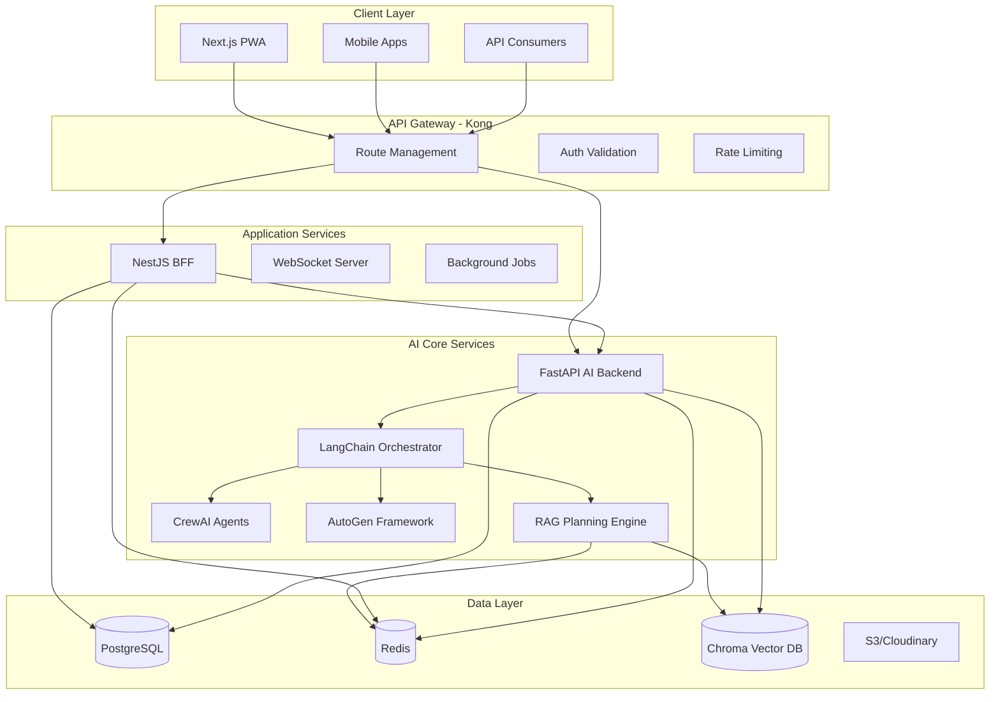
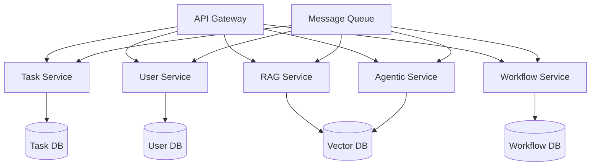
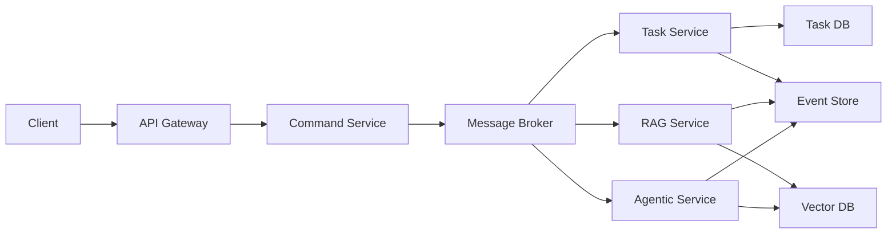
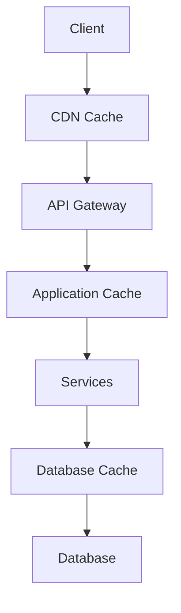
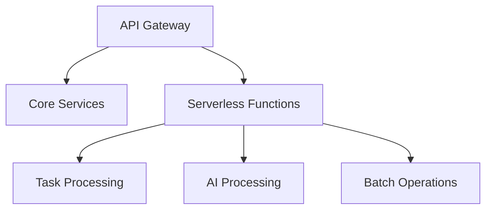
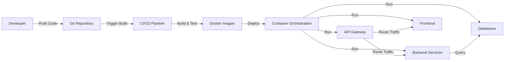

# Think-Tank Project Architecture Analysis

## 1. Project Overview and Purpose

Think-Tank is a hybrid system that combines task management functionality with advanced AI research capabilities. The project has evolved from a traditional separated frontend/backend architecture to an integrated monorepo approach, allowing for tighter coupling between components and more efficient development workflows.

### Core Purpose

The system serves as both:
1. A structured task management platform with features for creating, organizing, and tracking tasks
2. An advanced AI research assistant leveraging RAG (Retrieval-Augmented Generation) and agentic capabilities

This dual nature allows Think-Tank to provide intelligent assistance while maintaining a structured approach to organizing information and workflows.

### Evolution Path

The project structure has evolved from:
- Initial separate frontend (Next.js) and backend (FastAPI) directories
- To a more integrated monorepo approach with shared components and services

This evolution reflects modern development practices that prioritize cohesion and developer experience.

## 2. Architecture Components

The Think-Tank architecture follows a layered approach with clear separation of concerns:

### Frontend Layer

The frontend is built using React and Next.js, with a component-based architecture:

- **Task Management UI**:
  - `TaskChecklist.tsx`: Main component for displaying and managing tasks
  - `TaskItem.tsx`: Individual task component with toggle, edit, and delete functionality
  - `TaskForm.tsx`: Form for creating new tasks
  - `TaskContext.tsx`: React Context for state management across components

- **State Management**:
  - Uses React Context API for state management
  - Provides functions for CRUD operations on tasks
  - Handles loading states and error handling

### Backend Layer

The backend is built using Python with FastAPI:

- **API Endpoints**:
  - `/api/tasks`: RESTful endpoints for task management
  - Future endpoints for AI capabilities (planned)

- **Service Layer**:
  - `TaskService`: Handles business logic for task operations
  - `RAGEngine`: Manages retrieval and augmentation of knowledge
  - `AgenticParser`: Parses and enhances queries with actionable logic
  - `WorkflowManager`: Orchestrates the flow between components

- **Data Access Layer**:
  - SQLAlchemy ORM for database operations
  - Models for User, Task, KnowledgeItem, TALBlock, and Debate

### AI Core Services

The AI capabilities are centered around several key components:

- **RAG Engine**:
  - Retrieves relevant knowledge based on queries
  - Augments queries with retrieved knowledge
  - Integrates with vector search for semantic matching

- **Agentic Parser**:
  - Identifies enhancement triggers in queries
  - Applies domain-specific logic
  - Adapts content based on model capabilities

- **Workflow Manager**:
  - Processes queries through the RAG workflow
  - Orchestrates debates among expert agents
  - Generates appropriate outputs based on parsed data

- **Vector Search**:
  - Manages vector stores for knowledge and TAL blocks
  - Provides similarity search functionality
  - Supports adding new documents to the vector store

### Data Layer

The data layer consists of multiple storage solutions:

- **PostgreSQL**:
  - Stores structured data (users, tasks, etc.)
  - Maintains relationships between entities
  - Handles transactional operations

- **Redis**:
  - Provides caching for improved performance
  - Supports session management
  - Enables real-time features

- **Chroma Vector DB**:
  - Stores vector embeddings for semantic search
  - Maintains knowledge items and TAL blocks
  - Enables efficient similarity matching

### Infrastructure

The infrastructure is containerized using Docker:

- **Docker Compose**:
  - Defines services for PostgreSQL, Redis, ChromaDB, and Kong
  - Manages service dependencies and networking
  - Provides volume management for persistence

- **Kong API Gateway**:
  - Routes traffic to appropriate services
  - Handles authentication and rate limiting
  - Provides CORS support

## 3. Technology Stack

The Think-Tank project leverages a modern technology stack:

### Frontend Technologies
- **Next.js**: React framework for server-rendered applications
- **React**: UI library for component-based development
- **TypeScript**: Typed superset of JavaScript
- **react-beautiful-dnd**: Library for drag-and-drop functionality

### Backend Technologies
- **Python**: Primary programming language
- **FastAPI**: Modern, high-performance web framework
- **SQLAlchemy**: SQL toolkit and ORM
- **Pydantic**: Data validation and settings management
- **Uvicorn**: ASGI server

### AI and ML Technologies
- **LangChain**: Framework for LLM applications
- **OpenAI**: API for language model access
- **ChromaDB**: Vector database for embeddings

### Database Technologies
- **PostgreSQL**: Relational database
- **Redis**: In-memory data store
- **Chroma**: Vector database

### Infrastructure Technologies
- **Docker**: Containerization platform
- **Kong**: API gateway
- **Docker Compose**: Multi-container orchestration

## 4. Component Relationships

The components interact in a layered architecture with clear dependencies:

### Key Interactions

1. **Client to API Gateway**:
   - Clients make requests to the Kong API Gateway
   - Gateway routes requests to appropriate services

2. **API Gateway to Application Services**:
   - Requests are routed to NestJS BFF or directly to FastAPI
   - Authentication and rate limiting are applied

3. **Application Services to AI Core**:
   - NestJS BFF forwards AI-related requests to FastAPI
   - FastAPI handles AI processing using various frameworks

4. **AI Core to Data Layer**:
   - RAG Planning Engine retrieves data from Chroma Vector DB
   - Results are cached in Redis for performance
   - Persistent data is stored in PostgreSQL

## 5. Data Flow Analysis

The data flows through the system in several key patterns:

### Task Management Flow

1. User creates/updates a task via the frontend
2. Request is sent to the API Gateway
3. Gateway routes to the tasks API endpoint
4. TaskService processes the request
5. Database is updated via SQLAlchemy
6. Response is returned to the frontend
7. React Context updates the UI state

### AI Research Flow

1. User submits a query via the frontend
2. Request is routed through the API Gateway
3. RAG Engine retrieves relevant knowledge
4. Agentic Parser enhances the query
5. Workflow Manager orchestrates the process
6. Output is generated and returned to the frontend
7. UI displays the results to the user

### Integration Points

The task management and AI capabilities integrate at several points:

1. **Task Context Enhancement**: AI can provide context for tasks
2. **Intelligent Task Creation**: AI can suggest tasks based on context
3. **Task Analysis**: AI can analyze task patterns and provide insights

## 6. Key Configuration Files

Several configuration files define the system behavior:

### `config.py`
- Defines application settings
- Sets database connection parameters
- Configures CORS settings

### `docker-compose.yml`
- Defines services (PostgreSQL, Redis, ChromaDB, Kong)
- Sets up networking between services
- Configures volumes for persistence

### `kong.yml`
- Configures API routes
- Sets up CORS and rate limiting
- Defines service endpoints

### `setup.sh`
- Creates environment configuration
- Installs dependencies
- Initializes the database

## 7. Dependencies Between Components

The system has several key dependencies:

### Frontend Dependencies
- React depends on Next.js for server-side rendering
- TaskChecklist depends on TaskContext for state
- TaskItem depends on TaskContext for CRUD operations

### Backend Dependencies
- FastAPI depends on Uvicorn for serving
- TaskService depends on SQLAlchemy for database access
- RAG Engine depends on Vector Search for retrieval
- Workflow Manager depends on RAG Engine and Agentic Parser

### External Dependencies
- OpenAI API for language model access
- Auth0 for authentication (planned)
- S3/Cloudinary for file storage (planned)

## 8. Scalability Analysis and Evolution Path

### Current Scalability Considerations

The Think-Tank architecture includes several elements that support scalability:

1. **Containerization**: Docker-based deployment enables horizontal scaling
2. **API Gateway**: Kong provides load balancing and rate limiting
3. **Stateless Services**: Backend services are designed to be stateless
4. **Caching Layer**: Redis provides caching for improved performance

### Scalability Challenges

Despite these considerations, several challenges may arise as the system scales:

#### 1. Database Scalability

**Challenges**:
- PostgreSQL may become a bottleneck under high load
- Single database instance limits horizontal scaling
- Complex queries may slow down as data volume grows

**Evolution Path**:
- Implement database sharding for horizontal scaling
- Add read replicas for query-heavy workloads
- Consider a database-per-service approach for isolation

#### 2. Vector Database Performance

**Challenges**:
- ChromaDB performance may degrade with large vector collections
- Similarity search is computationally expensive
- Vector storage requires significant memory

**Evolution Path**:
- Implement vector database clustering
- Add caching layer for frequent queries
- Consider specialized hardware (GPU) for vector operations
- Explore more efficient indexing techniques (HNSW, IVF)

#### 3. AI Processing Scalability

**Challenges**:
- LLM API calls can be slow and expensive
- Complex workflows may have high latency
- Rate limits on external AI services

**Evolution Path**:
- Implement request batching for LLM calls
- Add queue-based processing for asynchronous workflows
- Consider local model deployment for reduced latency
- Implement caching for common AI responses

#### 4. Frontend Performance

**Challenges**:
- Large task lists may cause rendering performance issues
- Real-time updates could overwhelm the client

**Evolution Path**:
- Implement virtualization for large lists
- Add pagination for data-heavy views
- Consider progressive web app features for offline support

### Architecture Evolution for Scale

As the system grows, several architectural changes could be implemented:

#### 1. Microservices Decomposition

The current monolithic backend could be decomposed into specialized microservices:

This approach would allow:
- Independent scaling of services based on load
- Isolated failure domains
- Specialized optimization per service

#### 2. Event-Driven Architecture

Implementing an event-driven architecture would improve scalability:

Benefits include:
- Asynchronous processing for improved responsiveness
- Better handling of traffic spikes
- Improved system resilience

#### 3. Caching Strategy Enhancement

A multi-level caching strategy could significantly improve performance:

This would provide:
- Reduced latency for frequent requests
- Lower database load
- Improved user experience

#### 4. Serverless Functions for Bursty Workloads

Implementing serverless functions for certain operations could help handle variable load:

Benefits include:
- Auto-scaling to match demand
- Cost efficiency (pay-per-use)
- Simplified deployment for certain features

## 9. Security Assessment

The Think-Tank architecture includes several security measures:

### Authentication and Authorization

- JWT-based authentication
- OAuth2 password flow
- Token verification middleware

### Data Protection

- Environment-based configuration
- Secrets management via .env files
- Database connection security

### API Security

- Rate limiting via Kong
- CORS configuration
- Input validation with Pydantic

## 10. Deployment Architecture

The deployment architecture leverages containerization for consistency:

### Deployment Process

1. Code is pushed to the repository
2. CI/CD pipeline is triggered
3. Docker images are built and tested
4. Images are deployed to the container orchestration platform
5. Services are started and connected
6. API Gateway routes traffic to appropriate services

## 11. Recommendations for Future Development

Based on the architecture analysis, several recommendations emerge:

### 1. Scalability Enhancements

- Implement database sharding for horizontal scaling
- Add read replicas for query-heavy workloads
- Develop a comprehensive caching strategy
- Consider serverless functions for variable workloads

### 2. Architecture Improvements

- Gradually move toward a microservices architecture
- Implement event-driven patterns for better decoupling
- Add circuit breakers for improved resilience
- Develop a comprehensive monitoring solution

### 3. Development Process

- Implement automated testing for all components
- Add performance benchmarking to CI/CD pipeline
- Create comprehensive documentation
- Establish clear API contracts between services

### 4. AI Capabilities

- Implement model fallbacks for reliability
- Add result caching for common queries
- Develop a feedback loop for continuous improvement
- Consider local model deployment for reduced latency

## Conclusion

The Think-Tank project demonstrates a well-designed architecture that combines task management functionality with advanced AI capabilities. The system leverages modern technologies and architectural patterns to create a flexible and extensible platform.

As the system evolves, focusing on scalability, security, and maintainability will be crucial for long-term success. The recommendations provided in this analysis aim to guide that evolution toward a robust, scalable, and user-friendly platform.