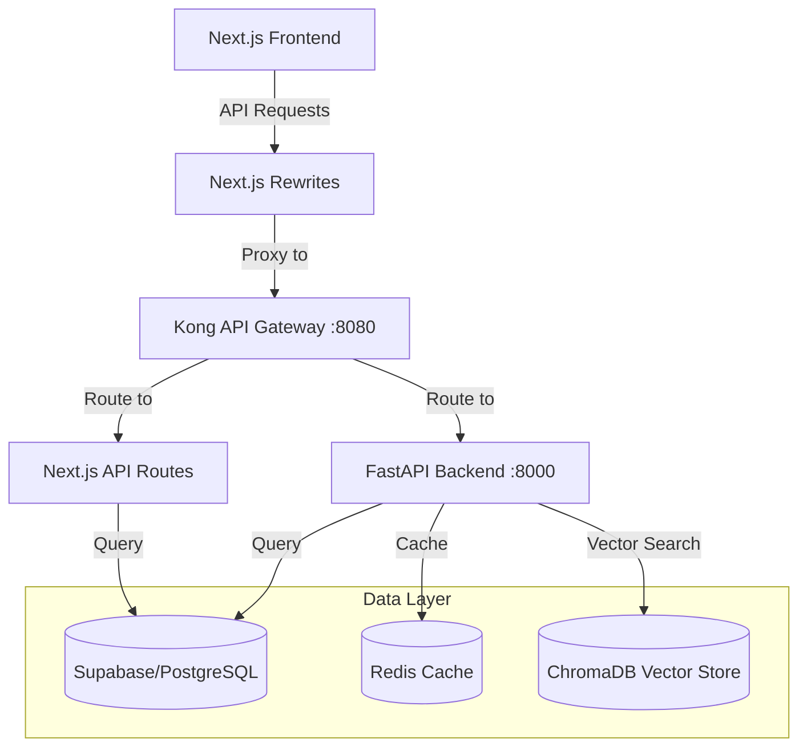

# Think-Tank Next.js Configuration Update Plan

## Current Architecture Understanding

The Think-Tank project has evolved into a hybrid architecture with:

1. **Frontend**: Next.js application with React components
2. **API Layer**: 
   - Next.js API routes (for basic CRUD operations)
   - FastAPI backend (for AI/ML services)
3. **API Gateway**: Kong running on port 8080
4. **Data Layer**: Supabase (PostgreSQL with pgvector)
5. **AI Services**: RAG Engine, Vector Search, etc.

## Current Configuration Issues

The current `next.config.js` file has the following configuration:

```javascript
/** @type {import('next').NextConfig} */
const nextConfig = {
  reactStrictMode: true,
  swcMinify: true,
  // The App Router is now the default in Next.js 14, so we don't need the experimental flag
  // Configure rewrites to proxy API requests to the FastAPI backend in development
  async rewrites() {
    return [
      {
        source: '/api/:path*',
        destination: process.env.BACKEND_URL || 'http://localhost:8000/api/:path*',
      },
    ];
  },
};

module.exports = nextConfig;
```

The issue is that it's currently pointing to port 8000, but the Kong API Gateway is running on port 8080.

## Proposed Solution

Update the Next.js configuration to:

1. Point to the Kong API Gateway at port 8080 by default
2. Maintain the ability to override with an environment variable
3. Keep the existing configuration options (reactStrictMode, swcMinify)
4. Add image optimization configuration
5. Add internationalization support

## Implementation Plan

### 1. Update next.config.js

```javascript
/** @type {import('next').NextConfig} */
const nextConfig = {
  reactStrictMode: true,
  swcMinify: true,
  
  // Image optimization configuration
  images: {
    domains: ['localhost', 'your-production-domain.com'],
    deviceSizes: [640, 750, 828, 1080, 1200, 1920, 2048, 3840],
    imageSizes: [16, 32, 48, 64, 96, 128, 256, 384],
    formats: ['image/webp'],
    minimumCacheTTL: 60,
    dangerouslyAllowSVG: false,
    contentSecurityPolicy: "default-src 'self'; script-src 'none'; sandbox;",
  },
  
  // Internationalization configuration
  i18n: {
    locales: ['en', 'es', 'fr', 'de'],
    defaultLocale: 'en',
    localeDetection: true,
  },
  
  // Configure rewrites to proxy API requests to the FastAPI backend in development
  async rewrites() {
    return [
      {
        source: '/api/:path*',
        destination: process.env.BACKEND_URL || 'http://localhost:8080/api/:path*',
      },
    ];
  },
};

module.exports = nextConfig;
```

### 2. Update Environment Variables

Ensure that the `.env.local` file includes the correct BACKEND_URL setting:

```
# API Gateway URL (Kong)
BACKEND_URL=http://localhost:8080/api
```

For production deployment, you would set this to your deployed FastAPI backend URL.

### 3. Documentation Updates

Add comments to the configuration file explaining:
- The purpose of the rewrites configuration
- How it works with the Kong API Gateway
- How to configure for different environments
- Image optimization settings and their purpose
- Internationalization configuration and supported locales

## Architecture Diagram



## Image Optimization Details

The image optimization configuration provides several benefits:

1. **Performance**: Automatically optimizes images for different device sizes
2. **Bandwidth**: Reduces image file sizes without sacrificing quality
3. **Modern Formats**: Serves WebP images to supported browsers
4. **Caching**: Configures caching behavior for optimized images

### Configuration Options Explained:

- **domains**: Allowlist of external domains that can be optimized
- **deviceSizes**: The sizes (in pixels) that should be generated for different devices
- **imageSizes**: The sizes (in pixels) that should be used for responsive images
- **formats**: Image formats that should be generated
- **minimumCacheTTL**: Minimum time (in seconds) that optimized images should be cached
- **dangerouslyAllowSVG**: Whether SVG images should be optimized (disabled for security)
- **contentSecurityPolicy**: CSP header for optimized images

## Internationalization Details

The internationalization configuration enables:

1. **Multiple Languages**: Support for English, Spanish, French, and German
2. **Automatic Detection**: Detects user's preferred language from browser settings
3. **URL Localization**: Adds locale prefix to URLs (e.g., `/en/about`, `/es/about`)
4. **SEO Benefits**: Improves search engine optimization for international audiences

### Configuration Options Explained:

- **locales**: List of supported locale codes
- **defaultLocale**: The default locale when no locale is specified
- **localeDetection**: Whether to automatically detect the user's preferred locale

## Deployment Considerations

1. **Local Development**: 
   - Kong API Gateway runs on port 8080
   - FastAPI backend runs on port 8000
   - Next.js frontend runs on port 3000

2. **Production Deployment**:
   - Next.js frontend deployed to Vercel
   - FastAPI backend deployed to a service like Render
   - BACKEND_URL environment variable set to the deployed FastAPI URL
   - Image optimization will work with Vercel's built-in image optimization service
   - Internationalization will be handled by Next.js routing

## Testing Plan

1. Update the configuration file
2. Start the local development environment:
   - Start Kong API Gateway (`docker-compose up api-gateway`)
   - Start FastAPI backend (`uvicorn main:app --reload`)
   - Start Next.js frontend (`npm run dev`)
3. Test API requests from the frontend to ensure they're correctly routed through Kong to the FastAPI backend
4. Verify that Next.js API routes continue to function correctly
5. Test image optimization by adding images with the Next.js Image component
6. Test internationalization by accessing the site with different locales

## Rollback Plan

If issues arise, revert to the original configuration:

```javascript
/** @type {import('next').NextConfig} */
const nextConfig = {
  reactStrictMode: true,
  swcMinify: true,
  // The App Router is now the default in Next.js 14, so we don't need the experimental flag
  // Configure rewrites to proxy API requests to the FastAPI backend in development
  async rewrites() {
    return [
      {
        source: '/api/:path*',
        destination: process.env.BACKEND_URL || 'http://localhost:8000/api/:path*',
      },
    ];
  },
};

module.exports = nextConfig;
```

## Future Considerations

1. **Content Delivery Network (CDN)**: Configure image domains for CDN integration
2. **Additional Locales**: Process for adding new languages to the application
3. **Performance Monitoring**: Track image optimization and internationalization impact on performance
4. **SEO Optimization**: Ensure proper metadata for different locales